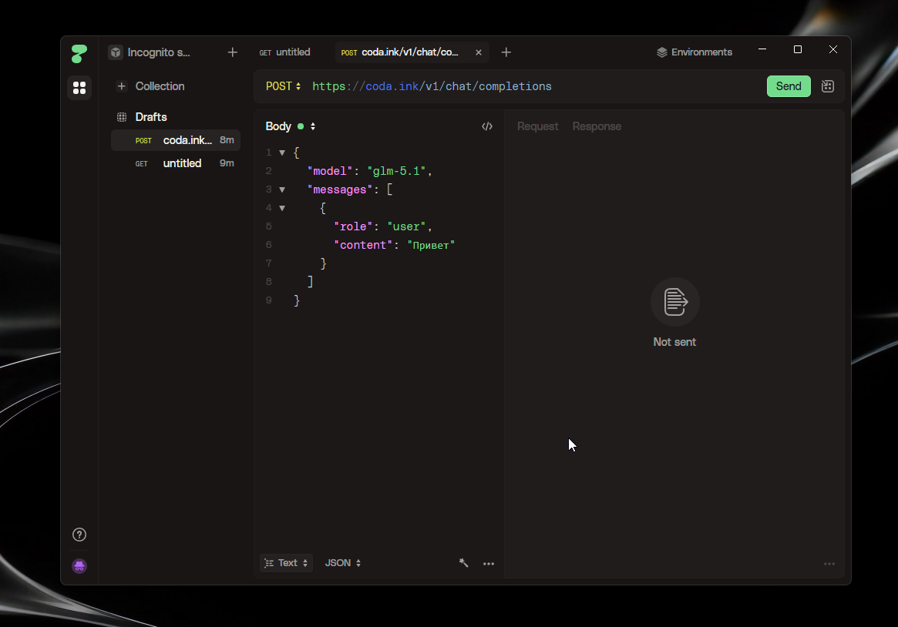

# HTTPie Desktop for Windows

<p align="center">
  
</p>

A native Windows desktop wrapper for [HTTPie Web App](https://httpie.io/app) — because the official Windows app leaves a lot to be desired.

Built with Electron. Uses native Windows titlebar overlay for a seamless, clean look.

---

## Features

- **Native Windows titlebar** — transparent overlay, no clunky custom bars
- **Persistent storage** — your sessions, cookies, and data survive restarts
- **Loading screen** — subtle spinner on launch while HTTPie loads
- **HTTPie icon** — proper icon in taskbar, alt+tab, window, everywhere
- **Lightweight** — minimal wrapper, HTTPie does the heavy lifting

## Install

Download the latest installer from [Releases](https://github.com/gotli/httpie-desktop/releases).

- **`HTTPie Desktop Setup x.x.x.exe`** — NSIS installer (recommended)
- **`HTTPie Desktop x.x.x.exe`** — portable, no install needed

## Dev

```bash
git clone https://github.com/gotli/httpie-desktop.git
cd httpie-desktop
npm install
npm start
```

## Build

```bash
npm run build            # NSIS installer + portable
npm run build:portable   # portable only
```

Output goes to `dist/`.

## Why?

HTTPie has an official macOS app that works great. The Windows version? Not so much. This is a simple, clean alternative — just the web app wrapped in a proper native window with a proper Windows titlebar.

## License

MIT
